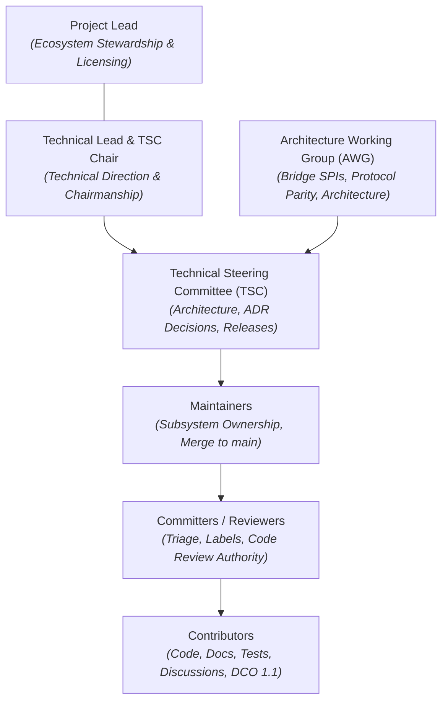
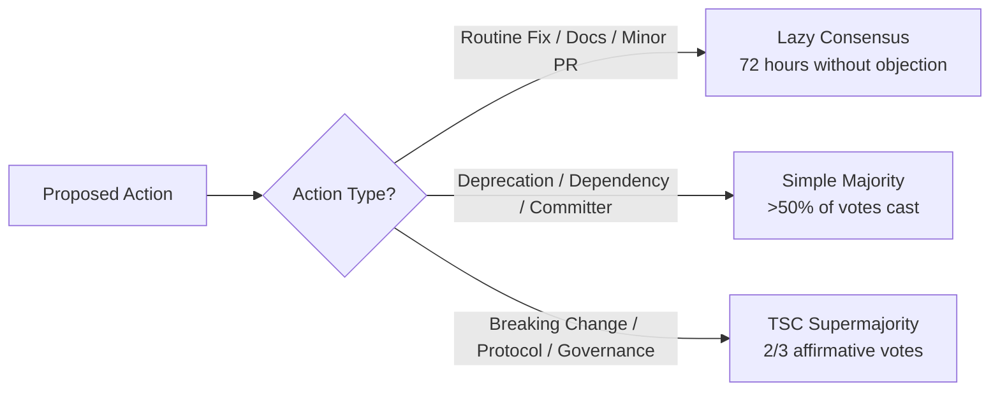

# Project Governance

This document establishes the open-source governance model for the **Server-Sent Events (SSE)** project (`spectrayan/server-sent-events`), adhering to open-source foundation and open governance standards. This project is an open-source, community-driven toolkit governed through transparent, vendor-neutral meritocracy.

---

## 1. Principles & Values

The Server-Sent Events project is guided by the following core values:

- **Openness & Transparency**: Technical roadmap planning, architectural debates, decision records, and release schedules are conducted in public forums (GitHub Issues, Discussions, and Pull Requests).
- **Meritocracy & Inclusivity**: Influence and review authority are earned through sustained technical contributions, high engineering standards, and constructive peer collaboration.
- **Vendor Neutrality**: The project is governed independently of commercial affiliations. Technical direction serves the long-term health of the open-source software ecosystem.
- **Individual Capacity & Representation**: Maintainers, reviewers, and contributors participate in the project as individuals in their personal capacity. Decision-making authority, technical influence, and voting rights are earned strictly through personal contributions and community stewardship, rather than corporate affiliation or commercial sponsorship.
- **Meritocratic Roles**: Governance is structured exclusively around defined open-source roles (*Project Lead*, *Technical Lead*, *Architecture Working Group*, *Technical Steering Committee*, *Maintainers*, *Committers*, and *Contributors*).
- **Psychological Safety**: All participants must treat one another with respect and abide by our [Code of Conduct](CODE_OF_CONDUCT.md).

---

## 2. Governance Structure & Roles



The governance hierarchy is structured into the following defined roles:

### 2.1 Project Lead
- Oversees project health, ecosystem partnerships, trademark and license stewardship, and institutional sponsor alignment.
- Works in tandem with the Technical Lead to sponsor the Technical Steering Committee (TSC).
- Mediates community disputes when escalated through formal governance processes.

### 2.2 Technical Lead
- Sets overall technical direction across the reactor modules (Spring WebFlux server `libs/sse-server`, bridges `sse-server-bridge-*`, and client libraries `libs/ng-sse-client`, `clients/*`).
- Serves as the Chair of the Technical Steering Committee (TSC).
- Coordinates cross-cutting initiatives and breaks technical deadlocks when required.

### 2.3 Architecture Working Group (AWG)
- A cross-functional group of experienced maintainers and domain specialists focused on core architectural challenges:
  - Reactive stream orchestration and Reactor backpressure semantics (`Mono`, `Flux`, `Sinks.Many`).
  - Multi-pod distributed event distribution and bridge SPI contracts (`SseBroadcastBridge`, Redis, Spring Cloud Stream, NATS).
  - Protocol conformance to the W3C Server-Sent Events / EventSource specification across polyglot clients (Angular, Go, Python, Kotlin/Android, Swift).
  - Resilient reconnection policies (jittered exponential backoff and `Last-Event-ID` session resumption).
  - High-throughput serialization contention handling (`FAIL_NON_SERIALIZED` spin-retries).
- Authors and vets Architecture Decision Records (ADRs) and Requests for Comments (RFCs).

### 2.4 Technical Steering Committee (TSC)
- The principal technical governing authority of the project.
- Responsibilities:
  - Final decision authority on Architecture Decision Records (ADRs).
  - Approving breaking changes and public API deprecations across server and client libraries.
  - Release governance, versioning milestones, and release train schedules.
  - Security vulnerability disclosures and incident oversight.
  - Amendments to project governance and policies.
  - Appointing new Maintainers and TSC members.
- Chaired by the Technical Lead with Project Lead sponsorship.

### 2.5 Maintainers
- Domain leads who have demonstrated technical leadership and deep expertise in one or more subsystems (e.g., Spring Boot SSE server, distribution bridges, client SDKs, CI/CD).
- Responsibilities:
  - Write and merge authority on branches and pull requests to `main`.
  - Reviewing code for correctness, security, performance, and style.
  - Subsystem release candidate validation.
  - Mentoring newcomers and nominating active contributors to Committer / Reviewer status.

### 2.6 Committers / Reviewers
- Active community members with sustained contributions (minimum 3 merged PRs) granted elevated community rights:
  - Issue triage and label management (e.g., `good first issue`, `type:bug`, `area:*`).
  - Formal code review authority (LGTM / Approvals).
  - Guiding new contributors through the contribution workflow.

### 2.7 Contributors
- Anyone who interacts with the project by reporting bugs, suggesting features, participating in discussions, authoring documentation, or submitting pull requests under the Developer Certificate of Origin (DCO 1.1).

---

## 3. The 4-Tier Contributor Ladder

The Server-Sent Events project provides a transparent ladder for advancement within the community:

| Tier | Role | Scope & Authority | Qualification Criteria | Nomination & Approval Process |
|:---|:---|:---|:---|:---|
| **Tier 1** | **Contributor** | Open issues, PRs, docs, discussions; community code reviews | Open to all; sign-off commits per DCO 1.1 (`git commit -s`) | None (self-onboarding) |
| **Tier 2** | **Committer / Reviewer** | Issue triage, label assignment, formal PR code review authority | Minimum **3 merged PRs** demonstrating code quality, familiarity with architectural principles, and constructive code review etiquette | Nominated by any Maintainer; approved by simple majority vote of Maintainers |
| **Tier 3** | **Maintainer** | Subsystem stewardship, merge rights to `main`, branch management, release cuts | Sustained high-quality contributions over 3+ months, domain ownership of a subsystem, mentoring contributors | Nominated by any Maintainer; approved by simple majority vote of the TSC |
| **Tier 4** | **Technical Steering Committee (TSC)** | Architectural stewardship, final ADR approval, security advisories, release authorization | Exceptional cross-reactor architectural leadership, sustained stewardship in AWG, deep strategic engagement | Nominated by any TSC member; approved by **2/3 supermajority vote** of the TSC |

### Contributor Recognition & Eligibility
In recognition of foundational contributions to the polyglot ecosystem:
- **Timothy Kim ([@timothytkim](https://github.com/timothytkim))** authored the idiomatic Swift client library (#69, resolving #59) featuring Swift 6 concurrency, W3C chunk parsing, and jittered reconnection. Timothy Kim is recognized as a valued contributor and is welcomed to progress on the Committer / Reviewer path.

### 3.1 Stepping Down & Emeritus Status
Community members may step down from Maintainer or TSC roles at any time:
- Maintainers or TSC members inactive for more than 6 months without notice may be transitioned to **Emeritus** status by the TSC.
- Emeritus members remain permanently honored in [ACKNOWLEDGMENTS.md](ACKNOWLEDGMENTS.md) and may request reactivation via a simple majority vote of the TSC.

### 3.2 Project Continuity & Redundancy
To ensure uninterrupted project operations if any single individual becomes unavailable or steps down:
- **Administrative & Organization Redundancy**: Organization ownership, domain management, and repository administration in the `@spectrayan` GitHub organization are held across multiple administrative contacts and backup credentials.
- **Release Automation**: Release pipelines and publishing credentials (Maven Central, npm, GHCR, PyPI) are managed through organization-level GitHub Actions secrets and automated workflows, enabling any authorized Maintainer or TSC member to issue releases.
- **Review & Merge Rights**: Issue triage, pull request review, and merge authority on `main` are assigned to functional team aliases defined in `.github/CODEOWNERS`, ensuring that review and new releases can proceed within one week of any departure.

---

## 4. Decision-Making & Voting Mechanics

The project uses three tiers of decision-making depending on the scope of the change:



### 4.1 Lazy Consensus (Default)
Lazy consensus is the standard operating model for daily engineering activities:
- **Applies to**: Bug fixes, performance optimizations, documentation updates, test enhancements, and non-breaking feature additions.
- **Process**: The change is submitted as a GitHub Pull Request. If at least one Committer or Maintainer approves and no objections are raised within **72 hours**, the proposal is deemed accepted and may be merged.

### 4.2 Simple Majority (>50%)
A simple majority of votes cast by eligible voters is required for:
- Deprecating existing public APIs (with minimum one release cycle advance notice).
- Introducing or upgrading third-party library dependencies.
- Appointing new Committers / Reviewers (voted by Maintainers).
- Appointing new Maintainers (voted by TSC).

### 4.3 Two-Thirds (2/3) Supermajority of the TSC
A 2/3 affirmative supermajority of the Technical Steering Committee is required for:
- Accepting or superseding Architecture Decision Records (ADRs).
- Breaking architectural changes, protocol framing alterations, or backwards-incompatible API removals.
- Modifying licensing terms or license header requirements.
- Amending this `GOVERNANCE.md` document.
- Appointing new TSC members or removing members for Code of Conduct violations.

### 4.4 Voting Process & Deadlocks
- Votes are called on GitHub Discussions or Pull Requests with a minimum duration of **7 calendar days**.
- Quorum is achieved when at least 50% of eligible voters cast a ballot.
- In the event of an unbroken tie, the **Technical Lead & TSC Chair** casts the tie-breaking vote.

---

## 5. Architectural Governance (ADRs & RFCs)

Any change meeting any of the following criteria requires an **Architecture Decision Record (ADR)**:
1. Introduction of new broadcast bridge implementations (e.g. new messaging broker SPI providers).
2. Wire protocol framing or serialization contract changes between server emitters and clients.
3. Addition of new programming language client SDKs to `clients/`.
4. Reactive backpressure, thread scheduling, or non-blocking buffer architecture changes.
5. Public API breaking changes or removal of previously deprecated classes or interfaces.

---

## 6. Developer Certificate of Origin (DCO 1.1)

To ensure copyright integrity while maintaining a lightweight, contributor-friendly onboarding experience, the Server-Sent Events project adopts the standard **Developer Certificate of Origin (DCO 1.1)**.

Every contributor certifies that they authored or have permission to submit the code by including a signed-off trailer in their commit messages:

```bash
git commit -s -m "feat(client-swift): implement AsyncSequence streaming"
```

Which automatically appends:
```text
Signed-off-by: Full Name <contributor@example.com>
```

Pull requests lacking DCO sign-offs on any commit cannot be merged into `main`.

---

## 7. Security Vulnerability Reporting

Security disclosures must follow the coordinated process outlined in [SECURITY.md](SECURITY.md):
- Security issues must **not** be reported on public GitHub issues.
- Reports should be submitted privately via GitHub Security Advisories or emailed to `security@spectrayan.com`.
- The TSC will acknowledge receipt within 24 hours and issue fixes under an embargoed advisory until patches are released.

---

## 8. Amendments to Governance

This governance charter may be amended by opening a Pull Request modifying `GOVERNANCE.md`. Amendments require:
1. Formal public announcement on GitHub Discussions for at least 14 calendar days.
2. Review and consensus within the Architecture Working Group.
3. A **2/3 supermajority affirmative vote** of the Technical Steering Committee (TSC).
