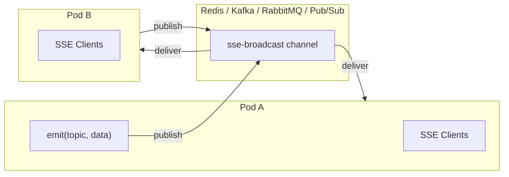
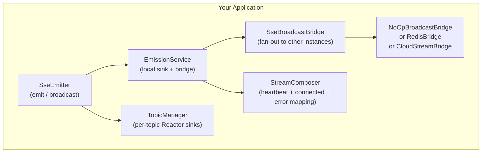

<div align="center">

# ⚡ Spectrayan SSE

**A production-ready Server-Sent Events toolkit for Spring Boot & Angular**

[](https://opensource.org/licenses/Apache-2.0)
[](https://openjdk.org)
[](https://spring.io/projects/spring-boot)
[](https://angular.dev)

Build real-time, event-driven applications with first-class SSE support on both server and client.
Zero boilerplate. Production-grade. Horizontally scalable.

[Server Docs](libs/sse-server/README.md) · [Client Docs](libs/ng-sse-client/README.md) · [Redis Bridge](libs/sse-server-bridge-redis/README.md) · [Cloud Stream Bridge](libs/sse-server-bridge-cloud-stream/README.md) · [Samples](samples/)

</div>

---

## 🏗️ What's in the box?

| Package | Description | Language |
|---------|-------------|----------|
| [`sse-server`](libs/sse-server/) | Reactive SSE emitter with auto-configuration, topic management, heartbeat, CORS, metrics & more | Java / Spring Boot |
| [`sse-server-bridge-redis`](libs/sse-server-bridge-redis/) | Multi-pod event fan-out via Redis Pub/Sub — just add the dependency, zero config | Java / Spring Data Redis |
| [`sse-server-bridge-cloud-stream`](libs/sse-server-bridge-cloud-stream/) | Multi-pod event fan-out via Kafka, RabbitMQ, Google Pub/Sub, or any Spring Cloud Stream binder | Java / Spring Cloud |
| [`ng-sse-client`](libs/ng-sse-client/) | Typed, zone-aware SSE client with auto-reconnect, backoff & jitter | TypeScript / Angular |
| [`sse-sample-server-app`](samples/sse-sample-server-app/) | Runnable Spring Boot sample emitting periodic events | Java |
| [`ng-sse-client-app`](samples/ng-sse-client-app/) | Angular sample app consuming an SSE stream | TypeScript |

---

## ✨ Key Features

### 🖥️ Spring WebFlux Server (`sse-server`)

- **Zero-config SSE endpoints** — auto-configured functional router at `GET /sse/{topic}`
- **Topic-based pub/sub** — emit to specific topics or broadcast to all
- **Built-in heartbeat** — keeps connections alive through proxies and load balancers
- **Session tracking** — lifecycle hooks for connect/disconnect events
- **Flexible serialization** — pluggable `EventSerializer` for custom payload encoding
- **MDC propagation** — bridge Reactor context to MDC for structured logging
- **CORS support** — auto-configured, scoped to SSE endpoints
- **Micrometer metrics** — emit/subscribe/error counters with optional per-topic labels
- **RFC 7807 errors** — structured `application/problem+json` error responses
- **Configurable backpressure** — choose MULTICAST or REPLAY sinks with tunable buffer sizes

### 🌐 Multi-Pod Scaling — *v2.0.0+*

- **Redis bridge** — add one dependency for instant multi-pod support via Redis Pub/Sub
- **Cloud Stream bridge** — use Kafka, RabbitMQ, Google Pub/Sub, Pulsar, or Azure Event Hubs
- **Zero custom code** — auto-configured bridges, just add a dependency
- **Self-deduplication** — instance-aware filtering prevents echo loops
- **Two options** — lightweight Redis or full Spring Cloud Stream binder ecosystem

### 📱 Angular Client (`ng-sse-client`)

- **Strongly-typed streams** — generic `parse` hook for compile-time safety
- **Smart reconnection** — exponential backoff with jitter, configurable limits
- **Zone-optimized** — runs outside Angular zone, re-enters on emissions for performance
- **Named events** — subscribe to specific SSE event types
- **Last-Event-ID** — automatic propagation for resumable streams

---

## 🚀 Quick Start

### Server (Spring Boot)

**1. Add the dependency**
```xml
<dependency>
  <groupId>com.spectrayan.sse</groupId>
  <artifactId>sse-server</artifactId>
  <version>2.0.0</version>
</dependency>
```

**2. Emit events from your service**
```java
@Service
@RequiredArgsConstructor
public class NotificationService {
    private final SseEmitter emitter;

    public void notifyUser(String userId, Notification notification) {
        emitter.emit(userId, "notification", notification);
    }

    public void broadcastAlert(Alert alert) {
        emitter.emit(alert);  // sends to all connected topics
    }
}
```

**3. Clients connect to the auto-configured endpoint**
```
GET http://localhost:8080/sse/my-topic
Accept: text/event-stream
```

That's it — no controllers, no routers, no configuration needed. The library auto-configures everything.

### Client (Angular)

```bash
npm install @spectrayan/ng-sse-client
```

```typescript
import { SseClient } from '@spectrayan/ng-sse-client';

@Component({ /* ... */ })
export class DashboardComponent {
  private sse = inject(SseClient);
  
  notifications$ = this.sse.stream<Notification>('/sse/notifications', {
    parse: (raw) => JSON.parse(raw),
    reconnect: true,
  });
}
```

---

## 🔄 Multi-Pod Deployment

> SSE is inherently stateful — connections are held in-memory on one server. In multi-pod deployments, events emitted on Pod A won't reach clients on Pod B.

**Choose your bridge — both require zero custom code:**

### Option 1: Redis (simplest)

```xml
<!-- One dependency — that's it -->
<dependency>
  <groupId>com.spectrayan.sse</groupId>
  <artifactId>sse-server-bridge-redis</artifactId>
  <version>2.0.0</version>
</dependency>
```

```yaml
spring:
  data:
    redis:
      host: localhost
      port: 6379
```

📖 [Full Redis bridge guide →](libs/sse-server-bridge-redis/README.md)

### Option 2: Spring Cloud Stream (Kafka, RabbitMQ, etc.)

```xml
<dependency>
  <groupId>com.spectrayan.sse</groupId>
  <artifactId>sse-server-bridge-cloud-stream</artifactId>
  <version>2.0.0</version>
</dependency>
<dependency>
  <groupId>org.springframework.cloud</groupId>
  <artifactId>spring-cloud-stream-binder-kafka</artifactId> <!-- or -rabbit, etc. -->
</dependency>
```

```yaml
spring:
  cloud:
    function:
      definition: sseBridgeConsumer
    stream:
      bindings:
        sseBridgeConsumer-in-0:
          destination: sse-broadcast
          group: ${spring.application.name}
```

📖 [Full Cloud Stream bridge guide →](libs/sse-server-bridge-cloud-stream/README.md)

### Architecture



---

## 🏢 Architecture



---

## 🛠️ Local Development

**Prerequisites:** Node.js 20+, Java 21, Maven 3.9+, Git

```bash
# Clone and setup
git clone https://github.com/spectrayan/server-sent-events.git
cd server-sent-events
make setup        # npm ci

# Build & test everything
make ci           # Angular build/test + Maven verify

# Or individually
make build-ng     # Angular library only
make verify-mvn   # Java libraries only
make clean        # Clean all build artifacts
```

---

## 📦 Libraries

| Library | README | Install |
|---------|--------|---------|
| **sse-server** | [📖 Docs](libs/sse-server/README.md) | Maven Central |
| **sse-server-bridge-cloud-stream** | [📖 Docs](libs/sse-server-bridge-cloud-stream/README.md) | Maven Central |
| **ng-sse-client** | [📖 Docs](libs/ng-sse-client/README.md) | npm |

## 🎮 Samples

| Sample | Description | Run |
|--------|-------------|-----|
| [`sse-sample-server-app`](samples/sse-sample-server-app/) | Spring Boot app emitting periodic events | `mvn spring-boot:run` |
| [`ng-sse-client-app`](samples/ng-sse-client-app/) | Angular app consuming SSE stream | `ng serve` |

---

<details>
<summary><strong>📋 Releasing (Maintainers)</strong></summary>

### Versioning Strategy

We follow a Spring-inspired versioning lifecycle for the Java libraries:

| Stage | Example | Target | Profile |
|-------|---------|--------|---------|
| **SNAPSHOT** | `2.1.0-SNAPSHOT` | OSSRH Snapshots | `-P snapshot` |
| **Milestone** | `2.1.0-M1` | Maven Central | `-P milestone` |
| **Release Candidate** | `2.1.0-RC1` | Maven Central | `-P rc` |
| **GA / Release** | `2.1.0` | Maven Central | `-P release` |

Angular packages follow standard npm semver and publish via Git tags.

### Prerequisites

1. **GPG key** — generate with `gpg --full-generate-key` (RSA 4096-bit)
2. **Maven `settings.xml`** — configure `central` and `ossrh-snapshots` servers
3. **Environment variables:** `GPG_PASSPHRASE`, `CENTRAL_USERNAME`, `CENTRAL_PASSWORD`, `OSSRH_USERNAME`, `OSSRH_PASSWORD`
4. **Clean Git state** — on `main`, no uncommitted changes

### Maven Commands

```bash
# Snapshot (can be overwritten)
mvn -P snapshot -DskipTests=false clean deploy

# Milestone / RC / GA release
mvn -P release \
    release:prepare release:perform \
    -DreleaseVersion=2.0.0 \
    -DdevelopmentVersion=2.0.1-SNAPSHOT \
    -DlocalCheckout=true -DupdateWorkingCopyVersions=false -DpushChanges=false
```

### CI Workflows

| Workflow | Trigger | What it does |
|----------|---------|-------------|
| `libs-release.yml` | Push to `main` / manual | Build + test all, auto-publish to GitHub Packages |
| `libs-snapshot.yml` | Manual | Deploy SNAPSHOT to Maven Central |
| `libs-milestone.yml` | Manual (with inputs) | Milestone / RC / GA release to Maven Central |

### npm Publishing

```bash
npm run build ng-sse-client
(cd dist/libs/ng-sse-client && npm publish --access public)
```

</details>

---

## 🤝 Contributing

We welcome contributions! Please read:
- [`CONTRIBUTING.md`](CONTRIBUTING.md) — how to contribute
- [`CODE_OF_CONDUCT.md`](CODE_OF_CONDUCT.md) — community guidelines
- [`SECURITY.md`](SECURITY.md) — reporting security vulnerabilities

## 📄 License

This project is licensed under the [Apache License 2.0](LICENSE).

## 💬 Support

Questions, issues, or feedback: **support@spectrayan.com**
