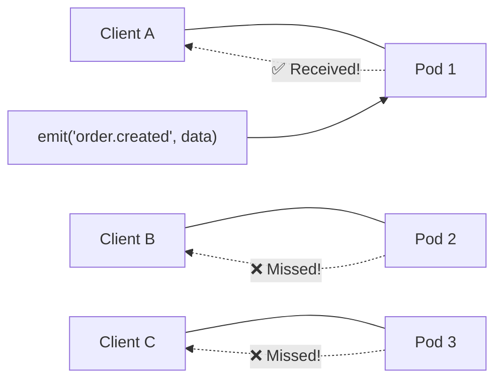
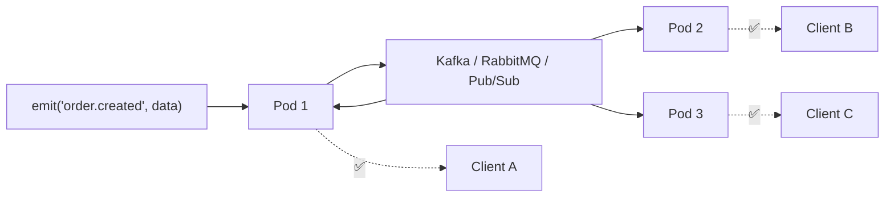
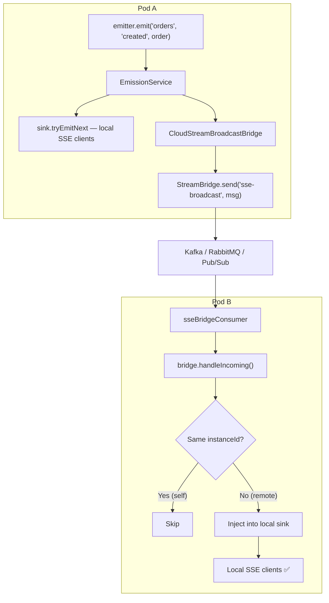

<div align="center">

# 🌐 Spectrayan SSE — Cloud Stream Bridge

**Cross-instance SSE event delivery for multi-pod deployments**

[](https://central.sonatype.com/artifact/com.spectrayan.sse/sse-server-bridge-cloud-stream)
[](https://spring.io/projects/spring-cloud)
[](https://opensource.org/licenses/Apache-2.0)

Add two dependencies. Configure three lines of YAML.
Your SSE events now reach every client, regardless of which pod they're connected to.

</div>

---

## 🤔 The Problem

SSE connections are inherently stateful — each client holds an open HTTP connection to a specific server instance. In multi-pod deployments (Kubernetes, ECS, Cloud Run, etc.), events emitted on one pod are invisible to clients connected to other pods:



## ✅ The Solution

This module implements the `SseBroadcastBridge` SPI from `sse-server` using Spring Cloud Stream. When an event is emitted on any pod, it's automatically published to a shared messaging channel. Every pod subscribes to that channel and injects remote events into its local SSE sinks:



---

## 🚀 Quick Start

### Step 1: Add dependencies

Choose your broker and add **two** dependencies:

<details open>
<summary><strong>Apache Kafka</strong></summary>

```xml
<dependency>
  <groupId>com.spectrayan.sse</groupId>
  <artifactId>sse-server-bridge-cloud-stream</artifactId>
  <version>2.0.0</version>
</dependency>
<dependency>
  <groupId>org.springframework.cloud</groupId>
  <artifactId>spring-cloud-stream-binder-kafka</artifactId>
</dependency>
```
</details>

<details>
<summary><strong>RabbitMQ</strong></summary>

```xml
<dependency>
  <groupId>com.spectrayan.sse</groupId>
  <artifactId>sse-server-bridge-cloud-stream</artifactId>
  <version>2.0.0</version>
</dependency>
<dependency>
  <groupId>org.springframework.cloud</groupId>
  <artifactId>spring-cloud-stream-binder-rabbit</artifactId>
</dependency>
```
</details>

<details>
<summary><strong>Google Cloud Pub/Sub</strong></summary>

```xml
<dependency>
  <groupId>com.spectrayan.sse</groupId>
  <artifactId>sse-server-bridge-cloud-stream</artifactId>
  <version>2.0.0</version>
</dependency>
<dependency>
  <groupId>com.google.cloud</groupId>
  <artifactId>spring-cloud-gcp-pubsub-stream-binder</artifactId>
</dependency>
```
</details>

<details>
<summary><strong>Apache Pulsar</strong></summary>

```xml
<dependency>
  <groupId>com.spectrayan.sse</groupId>
  <artifactId>sse-server-bridge-cloud-stream</artifactId>
  <version>2.0.0</version>
</dependency>
<dependency>
  <groupId>org.springframework.cloud</groupId>
  <artifactId>spring-cloud-stream-binder-pulsar</artifactId>
</dependency>
```
</details>

<details>
<summary><strong>Azure Event Hubs</strong></summary>

```xml
<dependency>
  <groupId>com.spectrayan.sse</groupId>
  <artifactId>sse-server-bridge-cloud-stream</artifactId>
  <version>2.0.0</version>
</dependency>
<dependency>
  <groupId>com.azure.spring</groupId>
  <artifactId>spring-cloud-azure-stream-binder-eventhubs</artifactId>
</dependency>
```
</details>

### Step 2: Configure Spring Cloud Stream

```yaml
spectrayan:
  sse:
    server:
      bridge:
        enabled: true                    # default
        channel-name: sse-broadcast      # logical channel name

spring:
  cloud:
    function:
      definition: sseBridgeConsumer
    stream:
      bindings:
        sseBridgeConsumer-in-0:
          destination: sse-broadcast      # must match channel-name
          group: ${spring.application.name}
```

### Step 3: Deploy

That's it. Your existing `emitter.emit()` calls now automatically fan out across all pods. **No code changes required.**

---

## ⚙️ How It Works



### Self-Deduplication

Each pod has a unique `instanceId` (auto-generated UUID, or configured). When a message arrives from the shared channel:
- If `message.originInstanceId == myInstanceId` → **skip** (we already emitted it locally)
- Otherwise → **inject** into local topic sink

This prevents double-delivery on the originating pod.

---

## 📋 Configuration Reference

| Property | Default | Description |
|----------|---------|-------------|
| `spectrayan.sse.server.bridge.enabled` | `true` | Master switch. Set to `false` to disable the bridge even with this module on the classpath. |
| `spectrayan.sse.server.bridge.channel-name` | `sse-broadcast` | Logical destination name. Maps to a Kafka topic, RabbitMQ exchange, Pub/Sub topic, etc. |
| `spectrayan.sse.server.bridge.instance-id` | *(auto UUID)* | Unique identifier for this pod instance. Used for self-deduplication. Auto-generated at startup if not configured. |

### Spring Cloud Stream Bindings

| Binding | Required | Purpose |
|---------|----------|---------|
| `sseBridgeConsumer-in-0.destination` | ✅ | Must match `bridge.channel-name` |
| `sseBridgeConsumer-in-0.group` | ✅ | Consumer group — use `${spring.application.name}` |

### ⚠️ Consumer Group is Critical

The `group` property on `sseBridgeConsumer-in-0` must be set correctly:

| Setting | Behavior | Correct? |
|---------|----------|----------|
| `group: my-app` (same for all pods) | All pods of the same service share a group — **each pod receives every message** | ✅ |
| `group:` *(empty/missing)* | Anonymous consumer — durable subscriptions lost on restart | ❌ |
| `group: pod-${random}` *(unique per pod)* | Each pod only gets a subset of messages | ❌ |

---

## 🧩 Architecture

### SPI Layer (`sse-server` core — no dependencies)

| Type | Purpose |
|------|---------|
| `SseBroadcastBridge` | Interface: `publish()` + `subscribe()` + `close()` |
| `SseBridgeMessage` | Record envelope: `originInstanceId`, `topic`, `eventName`, `payload`, `id`, `timestamp` |
| `SseBroadcastListener` | `@FunctionalInterface` callback for received events |
| `NoOpBroadcastBridge` | Default bean for single-instance deployments |

### Implementation Layer (this module)

| Type | Purpose |
|------|---------|
| `CloudStreamBroadcastBridge` | Publishes via `StreamBridge`, receives via functional consumer |
| `CloudStreamBridgeAutoConfiguration` | `@ConditionalOnClass(StreamBridge.class)` — activates only when Spring Cloud Stream is present |
| `sseBridgeConsumer` | Functional `Consumer<Message<SseBridgeMessage>>` bean auto-bound to the input channel |

---

## 🛑 Disabling the Bridge

If this module is on the classpath but you want to disable it for a specific environment (e.g., local development):

```yaml
spectrayan:
  sse:
    server:
      bridge:
        enabled: false
```

The library falls back to `NoOpBroadcastBridge` — single-instance mode, exactly like v1.x behavior.

---

## 🧪 Testing

The module includes tests with mocked `StreamBridge` (no broker required):

```bash
# From repo root
mvn test -pl libs/sse-server-bridge-cloud-stream -am
```

For integration tests with an actual broker, add the Spring Cloud Stream test binder:

```xml
<dependency>
  <groupId>org.springframework.cloud</groupId>
  <artifactId>spring-cloud-stream-test-binder</artifactId>
  <scope>test</scope>
</dependency>
```

---

## 🏗️ Build

```bash
# Compile
mvn compile -pl libs/sse-server-bridge-cloud-stream -am

# Test
mvn test -pl libs/sse-server-bridge-cloud-stream -am

# Full verify
mvn verify -pl libs/sse-server-bridge-cloud-stream -am
```

## 📄 License

[Apache License 2.0](../../LICENSE)

## 💬 Support

Questions or issues: **support@spectrayan.com**
