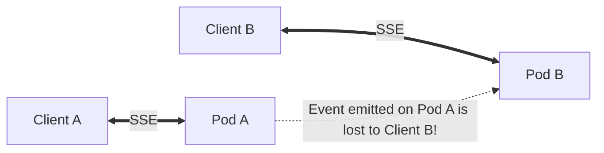
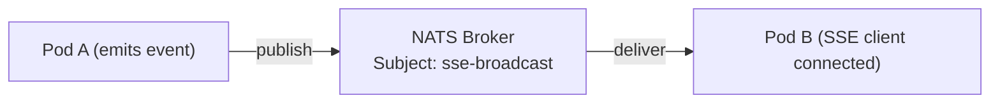
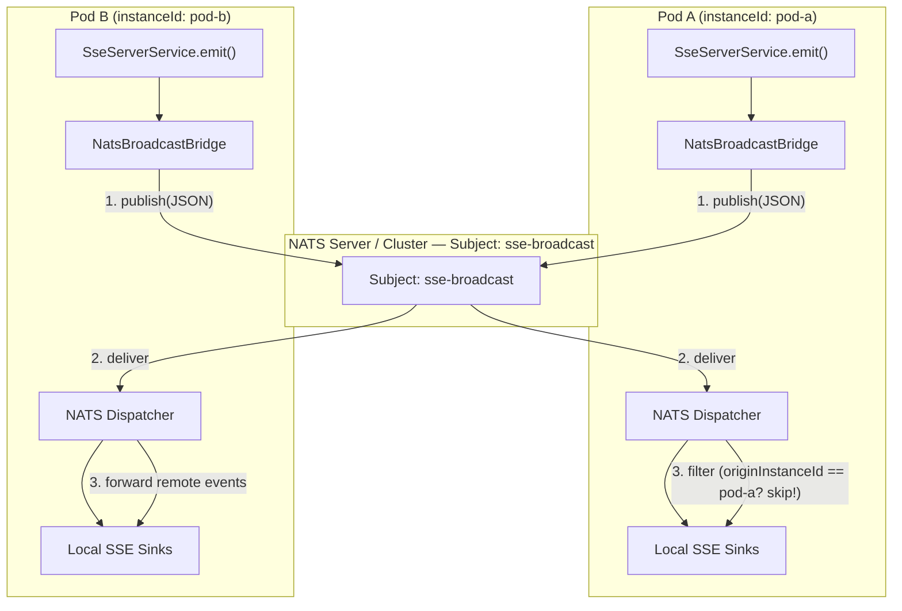

<div align="center">

# ⚡ sse-server-bridge-nats

**NATS Pub/Sub bridge for lightweight, sub-millisecond multi-pod SSE fan-out**

[](https://central.sonatype.com/artifact/com.spectrayan.sse/sse-server-bridge-nats)
[](https://spring.io/projects/spring-boot)
[](https://nats.io)
[](https://opensource.org/licenses/Apache-2.0)

Drop-in multi-pod SSE event fan-out using NATS — zero Spring Cloud Stream overhead, sub-millisecond latency.
Just add the dependency and point to your NATS broker. Zero boilerplate.

</div>

---

## 🎯 The Problem

When your application runs across multiple pods behind a load balancer, SSE clients establish persistent HTTP connections to **one specific pod**. Events emitted on Pod A are lost to clients connected to Pod B unless the instances coordinate.



## ⚡ The Solution

This module auto-configures a NATS broadcast bridge that synchronizes SSE events across all pods with sub-millisecond latency:



**Every pod publishes to NATS. Every pod subscribes via an asynchronous Dispatcher. Self-originated events are filtered out automatically.**

---

## 🚀 Quick Start

### 1. Add the dependency

```xml
<dependency>
    <groupId>com.spectrayan.sse</groupId>
    <artifactId>sse-server-bridge-nats</artifactId>
    <version>2.1.0</version>
</dependency>
```

### 2. Configure NATS

In `application.yml`:

```yaml
spectrayan:
  sse:
    server:
      bridge:
        nats:
          server: nats://localhost:4222
```

*(If you already have an `io.nats.client.Connection` bean registered — e.g., via `nats-spring` — the bridge detects and reuses it automatically!)*

### 3. Done!

That's it. The bridge auto-configures itself and replaces the default `NoOpBroadcastBridge`. Any event published locally via `SseEmitter` or `SseServerService` is automatically broadcast across all pods.

---

## ⚙️ Configuration Properties

All properties are optional with sensible defaults:

| Property | Default | Description |
|---|---|---|
| `spectrayan.sse.server.bridge.enabled` | `true` | Global enable/disable flag for cross-pod bridge |
| `spectrayan.sse.server.bridge.nats.enabled` | `true` | Enable/disable the NATS broadcast bridge specifically |
| `spectrayan.sse.server.bridge.nats.server` | `nats://localhost:4222` | NATS broker URL |
| `spectrayan.sse.server.bridge.nats.subject` | `sse-broadcast` | NATS subject for event fan-out (falls back to `bridge.channel-name`) |
| `spectrayan.sse.server.bridge.nats.queue-group` | *null* | Optional queue group for load-balanced consumption instead of broadcast fan-out |
| `spectrayan.sse.server.bridge.nats.token` | *null* | Optional authentication token |
| `spectrayan.sse.server.bridge.nats.username` | *null* | Optional authentication username |
| `spectrayan.sse.server.bridge.nats.password` | *null* | Optional authentication password |
| `spectrayan.sse.server.bridge.nats.credentials-file` | *null* | Path to user `.creds` file for JWT/NKey authentication |
| `spectrayan.sse.server.bridge.nats.connection-timeout` | `5s` | Connection timeout |
| `spectrayan.sse.server.bridge.nats.reconnect-wait` | `2s` | Wait duration between reconnect attempts |
| `spectrayan.sse.server.bridge.nats.max-reconnect` | `-1` (infinite) | Maximum reconnect attempts |
| `spectrayan.sse.server.bridge.instance-id` | *auto 8-char UUID* | Unique ID for this pod (used for self-deduplication) |

### Full Production Example

```yaml
spectrayan:
  sse:
    server:
      bridge:
        instance-id: ${HOSTNAME:pod-1}
        nats:
          server: nats://nats-cluster.internal:4222
          subject: production.sse.events
          credentials-file: /etc/nats/user.creds
          connection-timeout: 3s
          reconnect-wait: 1s
          max-reconnect: -1
```

---

## 🏗️ Architecture & How It Works



1. **Publish** — When a pod emits an SSE event locally, `NatsBroadcastBridge` serializes the `SseBridgeMessage` envelope to JSON via Jackson 3 and publishes to the NATS subject.
2. **Asynchronous Subscribe** — Every instance maintains an asynchronous NATS `Dispatcher` listening on the shared subject.
3. **Self-Deduplication** — When a message arrives, the bridge compares `message.originInstanceId()` against its own local `instanceId`. If matching, the event was locally emitted and is silently dropped.
4. **Local Fan-out** — Remote events are forwarded to `SseBroadcastListener.onRemoteEvent()`, which injects them directly into the pod's local topic sinks for immediate delivery to connected SSE clients.

---

## 🆚 Bridge Comparison Matrix

| Feature | `sse-server-bridge-nats` | `sse-server-bridge-redis` | `sse-server-bridge-cloud-stream` |
|---|---|---|---|
| **Underlying Broker** | NATS Core | Redis Pub/Sub | Kafka, RabbitMQ, Google Pub/Sub, etc. |
| **Dependency Footprint** | Minimal (`io.nats:jnats` ~1.5MB) | Small (`data-redis-reactive` ~4MB) | Large (`spring-cloud-stream` + binder ~15MB) |
| **Fan-out Latency** | **Sub-millisecond (~100-300µs)** | Fast (~1-2ms) | Standard (~5-20ms) |
| **Throughput** | Extremely high (millions msg/sec) | High | High |
| **Self-Deduplication** | Automatic | Automatic | Automatic |
| **Queue Group Support** | Yes (`queue-group` config) | No | Yes (consumer groups) |
| **Best For** | High-throughput, low-latency microservices | Apps already running Redis | Enterprises standardized on Kafka or RabbitMQ |

---

## 🐳 Local Testing

Start a local NATS broker with Docker:

```bash
docker run -d --name nats-dev -p 4222:4222 -p 8222:8222 nats:alpine -m 8222
```

Start two sample application instances:

```bash
# Terminal 1 - Pod A
SERVER_PORT=8080 SPECTRAYAN_SSE_SERVER_BRIDGE_INSTANCE_ID=pod-A mvn spring-boot:run

# Terminal 2 - Pod B
SERVER_PORT=8081 SPECTRAYAN_SSE_SERVER_BRIDGE_INSTANCE_ID=pod-B mvn spring-boot:run
```

Connect an SSE client to Pod B:

```bash
curl -N http://localhost:8081/sse/alerts
```

Emit an event on Pod A:

```bash
curl -X POST http://localhost:8080/api/emit \
  -H "Content-Type: application/json" \
  -d '{"topic":"alerts","data":"Hello from Pod A via NATS!"}'
```

The event will immediately arrive at the client connected to Pod B!

---

## 🔨 Building and Testing

```bash
# Compile and run unit tests
mvn clean test -pl libs/sse-server-bridge-nats

# Package module jar
mvn package -pl libs/sse-server-bridge-nats -DskipTests
```

---

## 📄 License

This module is licensed under the [Apache License, Version 2.0](../../LICENSE).

---

## 💬 Support

Questions or issues? Reach out at **support@spectrayan.com** or open a GitHub discussion.
